<h3><code>ykosu@github ~ $ ./stats.sh</code></h3>

  

<h3><code>ykosu@github ~ $ whoami</code></h3>

<table>
<tr>
<td valign="top"></td>
<td valign="top"></td>
</tr>
</table>

 

<h3><code>ykosu@github ~ $ ls ./projects</code></h3>

| | |
|---|---|
| [**telegram-booking-bot**](https://github.com/ykosu-svg/telegram-booking-bot) | Бот записи на услуги · `Python` |
| [**telegram-ai-consultant-bot**](https://github.com/ykosu-svg/telegram-ai-consultant-bot) | AI-консультант в Telegram · `Python` |
| [**desktop-file-organizer**](https://github.com/ykosu-svg/desktop-file-organizer) | Автосортировка файлов на рабочем столе · `Python` |
| [**file-order-manager**](https://github.com/ykosu-svg/file-order-manager) | Управление порядком файлов · `Python` |
| [**photo-widget**](https://github.com/ykosu-svg/photo-widget) | Виджет фото для десктопа · `Python` |
| [**clock-widget**](https://github.com/ykosu-svg/clock-widget) | Виджет часов · `C#` |

 
<code>stats-panel.svg</code> обновляется автоматически каждый день через GitHub Actions

